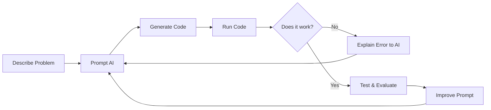
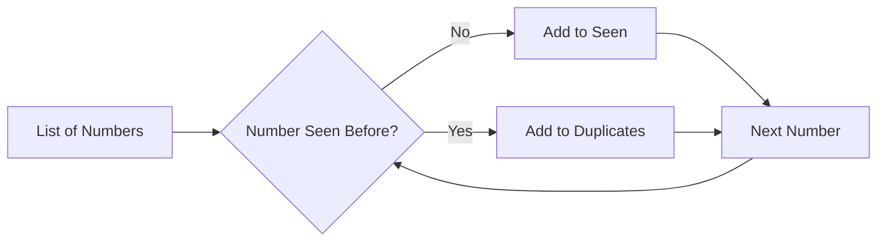
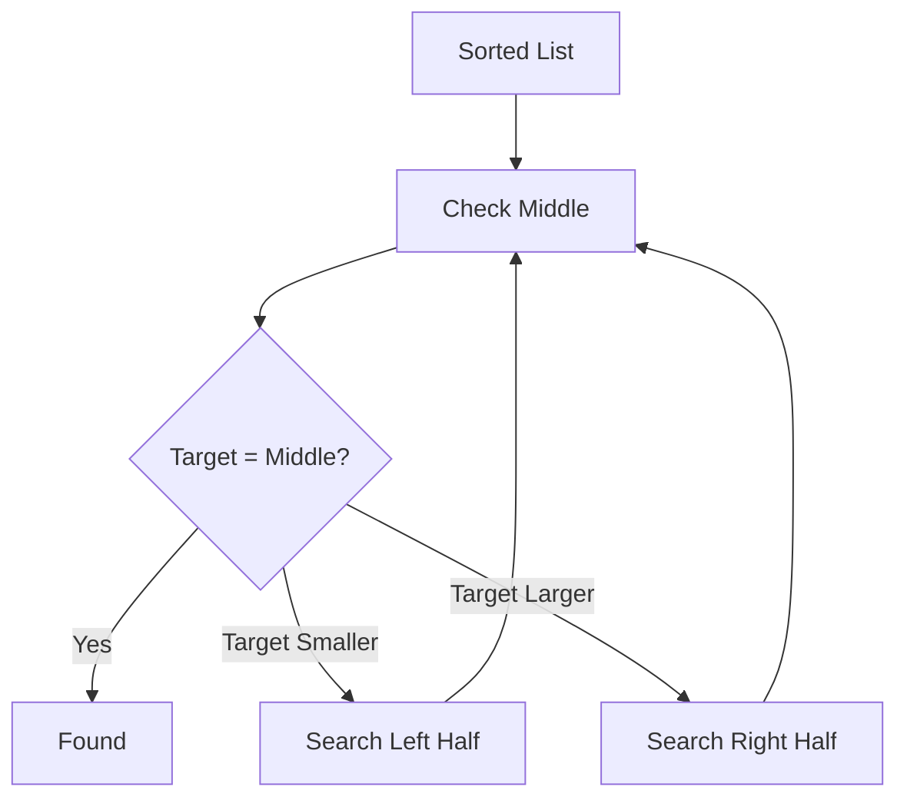
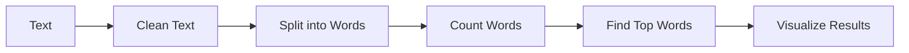
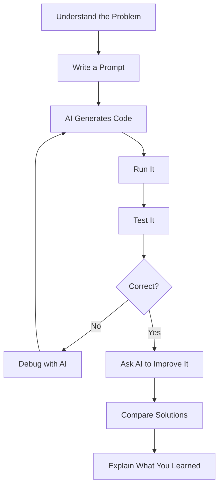
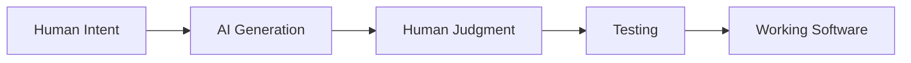

## vibe-coding-lab


Below is a concise `README.md` you can place alongside the notebook.

# **Vibe Coding with Python**

## **Applied AI**

### **Overview**

In this lab, we will explore **vibe coding**: using natural language to collaborate with an AI coding assistant to create, explain, debug, and improve software.

The objective is **not simply to have AI generate code**.

The objective is to learn how to:

- Clearly describe a problem.
- Ask an AI to generate a solution.
- Understand the generated code.
- Test whether the solution works.
- Identify mistakes or weaknesses.
- Ask the AI to improve the solution.
- Compare different algorithms and approaches.

------

## **What is Vibe Coding?**

Vibe coding is a programming workflow where you describe what you want in natural language and allow an AI coding assistant to generate much of the implementation.

A typical workflow looks like this:



The human is still responsible for deciding:

**What should the program do, and is the result correct?**

------

# **Exercises**

## **1. Fibonacci Series**

Generate numbers from the Fibonacci sequence:

```text
0, 1, 1, 2, 3, 5, 8, 13, 21, 34...
```

We will compare two implementations:

- Recursive Fibonacci
- Iterative Fibonacci

### **Vibe Coding Challenge**

Ask your AI coding assistant:

Explain why the iterative Fibonacci implementation is faster than the recursive implementation.

Then ask:

Modify the program to measure the execution time of both algorithms.

### **Think About**

Why does the recursive algorithm repeatedly calculate the same values?

------

## **2. Finding Duplicates**

Given:

```python
numbers = [4, 7, 2, 4, 9, 7, 10]
```

find the duplicate values.

We will compare:

- Nested loops
- Python `set`



### **Vibe Coding Challenge**

Ask:

Why is the version using a set faster?

Then:

Generate a list containing 100,000 random numbers and compare the execution time of both approaches.

------

## **3. Searching for a Number**

Find a target value inside a list.

We will compare:

### **Linear Search**

Check values one at a time.

```text
3 → 8 → 12 → 18 → 25 → 31 → 42
```

### **Binary Search**

Repeatedly eliminate half of the remaining values.



### **Vibe Coding Challenge**

Ask:

Modify binary search so that it prints every value it checks.

Then compare how many values are checked by linear search and binary search.

------

## **4. Most Common Word**

Use Python to analyze a paragraph and determine which word appears most frequently.

Example:

```text
AI is changing software development.
AI can generate code.
AI can also make mistakes.
```

### **Vibe Coding Challenge**

Start with:

Modify the program so punctuation does not affect the word count.

Then:

Display the five most common words and their counts.

Finally:

Create a bar chart showing the five most common words.

This demonstrates how a simple program can evolve through natural-language instructions.



------

## **5. Cybersecurity: Password Strength Checker**

Create a program that checks basic password characteristics.

For example:

- Minimum length
- Uppercase letters
- Lowercase letters
- Numbers
- Special characters

**Do not enter a real password into the exercise.**

### **Vibe Coding Challenge**

Ask:

Add a requirement that the password contain at least one special character.

Then:

Reject passwords that appear in a list of commonly used passwords.

Finally:

Instead of returning only “weak” or “strong,” explain which requirements failed.

------

# **The Vibe Coding Process**

For each exercise, follow the same process:



------

# **Don’t Just Accept the Code**

AI-generated code can:

- Contain bugs.
- Use inefficient algorithms.
- Misunderstand requirements.
- Produce incorrect results.
- Introduce security problems.
- Use libraries incorrectly.
- Appear correct while producing the wrong answer.

Therefore:

**Running without errors does not mean the program is correct.**

A better workflow is:

**Generate → Understand → Test → Validate → Improve**

------

# **Questions to Ask Your AI**

Instead of only saying:

Write the code.

Try prompts such as:

Explain this code to me.

Is there a more efficient algorithm?

What is the time complexity?

What edge cases am I missing?

Generate test cases for this function.

Try to break this program.

Compare this solution with another approach.

Explain the tradeoffs between the two implementations.

How would you make this production quality?

These prompts shift AI from being simply a **code generator** to being a **coding collaborator**.

------

# **Final Reflection**

After completing the exercises, choose one example and answer:

1. What was your original prompt?
2. What code did the AI generate?
3. Did it work correctly the first time?
4. How did you test it?
5. What did you ask the AI to improve?
6. Was the improved solution actually better?
7. What did you learn that you would not have learned by simply copying the generated code?

------

## **Key Takeaway**

Vibe coding changes how we write software, but it does not eliminate the need to understand software.



The most important skill is not generating more code.

It is being able to determine whether the generated code **solves the right problem and produces the right result**.

This is intentionally lightweight enough for a class GitHub repository while giving students instructions, prompts, diagrams, and reflection questions.
