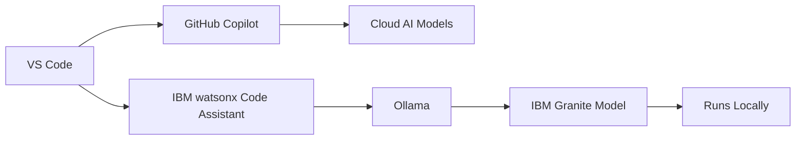
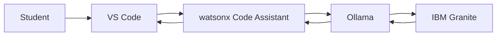
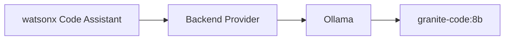
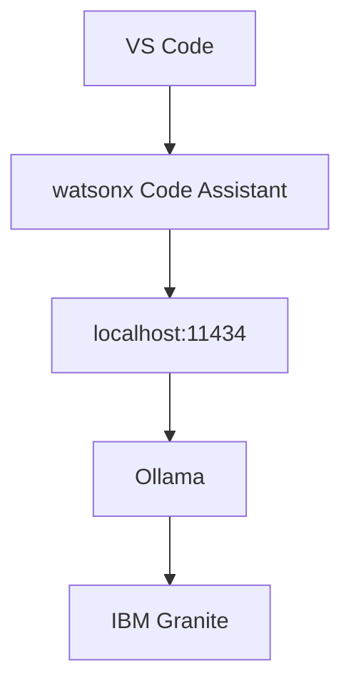
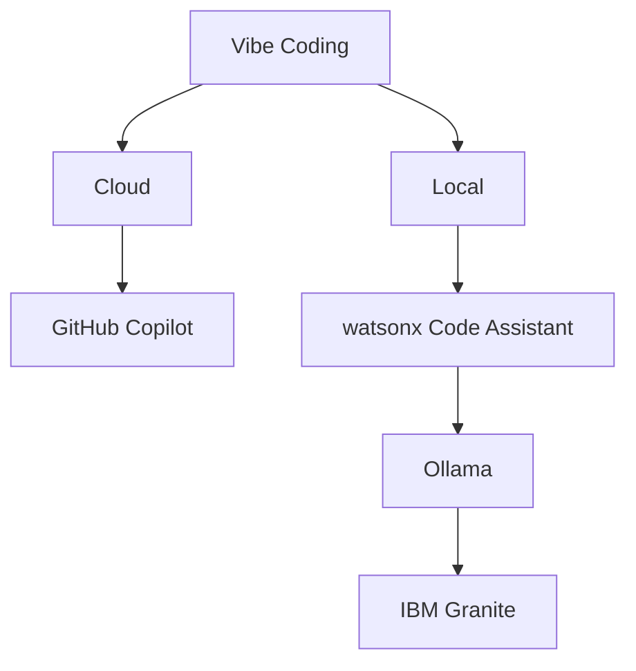
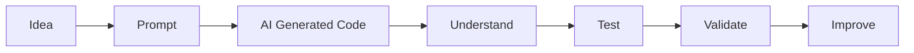

## vibe-vs-code-extensions


Here is a student-facing `README.md` focused specifically on setting up the two coding assistants for the lab.

# **AI Coding Assistants Setup**

## **Applied AI — Vibe Coding Lab**

In this lab, we will experiment with two different approaches to AI-assisted programming:

1. **GitHub Copilot** — cloud-based AI coding assistant.
2. **IBM watsonx Code Assistant + Ollama** — AI coding assistant using an IBM Granite model running locally on your computer.

Both will be used from **Visual Studio Code (VS Code)**.



------

# **1. Install Visual Studio Code**

Download and install Visual Studio Code if you do not already have it.

https://code.visualstudio.com/

Open VS Code after installation.

You will install both AI coding assistants as VS Code extensions.

------

# **2. GitHub Copilot**

GitHub Copilot provides code completion, chat, code explanation, code generation, and other AI-assisted development capabilities directly inside VS Code.

## **Install GitHub Copilot**

Open VS Code.

Select:

**Extensions → Search**

or use:

```text
Ctrl + Shift + X
```

On macOS:

```text
Cmd + Shift + X
```

Search for:

```text
GitHub Copilot
```

Select the extension published by **GitHub** and click:

```text
Install
```

Current versions of VS Code can also install the required Copilot components automatically when Copilot is initially configured. (⁠[GitHub Docs](https://docs.github.com/en/copilot/how-tos/set-up/install-copilot-extension?utm_source=chatgpt.com))

------

## **Sign In**

After installation, VS Code will ask you to sign in to GitHub.

Select:

```text
Sign in to GitHub
```

Your browser may open to authorize Visual Studio Code.

Complete the authorization and return to VS Code.

GitHub Copilot requires Copilot access. GitHub currently offers several access options, including Copilot Free and plans for eligible verified students and educators. (⁠[GitHub Docs](https://docs.github.com/en/copilot/how-tos/set-up/install-copilot-extension?utm_source=chatgpt.com))

Official instructions:

⁠[GitHub Copilot installation documentation](https://docs.github.com/en/copilot/how-tos/set-up/install-copilot-extension?utm_source=chatgpt.com)

------

# **3. Test GitHub Copilot**

Create a file:

```text
test.py
```

Type a comment:

```python
# Create a function that generates the first n Fibonacci numbers
```

Start typing:

```python
def fibonacci
```

Copilot should suggest code.

You can accept an inline suggestion with:

```text
Tab
```

You can also open **Copilot Chat** and ask:

```text
Write a Python function that generates
the first 20 Fibonacci numbers.
```

Copilot Chat can explain code, propose edits, and help validate files in addition to generating code. (⁠[GitHub Docs](https://docs.github.com/en/copilot/get-started/quickstart-for-using-github-copilot-in-your-ide?utm_source=chatgpt.com))

------

# **4. IBM watsonx Code Assistant + Ollama**

Next, we will create a **local AI coding environment**.

The architecture is different from GitHub Copilot:



For this lab, the Granite model executes on your computer through Ollama rather than requiring the IBM Cloud backend.

IBM officially supports using **watsonx Code Assistant Individual** with a local Granite model through Ollama. (⁠[IBM Cloud](https://cloud.ibm.com/docs/watsonx-code-assistant?locale=en&topic=watsonx-code-assistant-cloud-setup-wca-individual&utm_source=chatgpt.com))

------

# **5. Install Ollama**

Ollama provides the local environment used to run the language model.

Download Ollama from:

https://ollama.com/

### **macOS**

You can also install it using Homebrew:

```bash
brew install ollama
```

### **Linux**

One installation method is:

```bash
curl -fsSL https://ollama.com/install.sh | sh
```

IBM’s current setup documentation also provides these installation options. (⁠[IBM Cloud](https://cloud.ibm.com/docs/watsonx-code-assistant?locale=en&topic=watsonx-code-assistant-cloud-setup-wca-individual&utm_source=chatgpt.com))

------

# **6. Verify Ollama**

Open a terminal and run:

```bash
ollama --version
```

Then check the installed models:

```bash
ollama list
```

Start the Ollama server if necessary:

```bash
ollama serve
```

Ollama normally listens locally at:

```text
127.0.0.1:11434
```

If you see:

```text
Error: listen tcp 127.0.0.1:11434:
bind: address already in use
```

that normally means Ollama is **already running**. (⁠[IBM Cloud](https://cloud.ibm.com/docs/watsonx-code-assistant?locale=en&topic=watsonx-code-assistant-cloud-setup-wca-individual&utm_source=chatgpt.com))

------

# **7. Install IBM Granite**

For this lab, install IBM’s Granite code model:

```bash
ollama run granite-code:8b
```

The first time you execute the command, Ollama will download the model.

The download is approximately several GB, so allow some time.

When you see:

```text
>>>
```

you can talk directly to the model.

Try:

```text
Write a Python function that calculates
the Fibonacci sequence.
```

Exit with:

```text
/bye
```

IBM currently documents `granite-code:8b` as the default model for the local watsonx Code Assistant setup. (⁠[IBM Cloud](https://cloud.ibm.com/docs/watsonx-code-assistant?locale=en&topic=watsonx-code-assistant-cloud-setup-wca-individual&utm_source=chatgpt.com))

------

# **8. Install IBM watsonx Code Assistant**

Return to **VS Code**.

Open:

```text
Extensions
```

Search for:

```text
watsonx Code Assistant
```

Install the extension published by **IBM**.

⁠[IBM watsonx Code Assistant local setup documentation](https://cloud.ibm.com/docs/watsonx-code-assistant?locale=en&topic=watsonx-code-assistant-cloud-setup-wca-individual&utm_source=chatgpt.com)

------

# **9. Configure watsonx Code Assistant for Ollama**

Open VS Code **Settings**.

Search for:

```text
Wca Backend Provider
```

Set:

```text
Wca: Backend Provider
```

to:

```text
ollama
```

This is important.

We want:



not the IBM Cloud backend.

IBM’s documentation specifically identifies `ollama` as the backend-provider setting for local operation. (⁠[IBM Cloud](https://cloud.ibm.com/docs/watsonx-code-assistant?locale=en&topic=watsonx-code-assistant-cloud-setup-wca-individual&utm_source=chatgpt.com))

------

# **10. Verify the Model Configuration**

The default local code-generation model should be:

```text
granite-code:8b
```

If necessary, search VS Code settings for:

```text
Wca Local
```

Check:

```text
Wca > Local: Code Gen Model
```

and set it to:

```text
granite-code:8b
```

The local API host should normally be:

```text
127.0.0.1:11434
```

You normally do not need to change this unless your Ollama server is running somewhere else. (⁠[IBM Cloud](https://cloud.ibm.com/docs/watsonx-code-assistant?locale=en&topic=watsonx-code-assistant-cloud-setup-wca-individual&utm_source=chatgpt.com))

------

# **11. Test IBM watsonx Code Assistant**

Open the watsonx Code Assistant chat interface.

Ask:

```text
Write a Python function that generates
the first 20 Fibonacci numbers.
```

Then try:

```text
Explain the time complexity of this function.
```

Then:

```text
Can you create a more efficient version?
```

You now have a locally running AI coding assistant.

------

# **12. Verify That Ollama Is Running Locally**

From a terminal, run:

```bash
ollama list
```

You should see your Granite model.

You can also run:

```bash
ollama ps
```

to see currently loaded models.

Your basic architecture is now:



------

# **13. Troubleshooting**

## **Ollama Connection Error**

If watsonx Code Assistant reports that it cannot connect to Ollama, verify:

```bash
ollama serve
```

Then test the model directly:

```bash
ollama run granite-code:8b
```

If that works, Ollama and the model are functioning.

------

## **Model Not Found**

Run:

```bash
ollama list
```

If `granite-code:8b` does not appear, install it:

```bash
ollama pull granite-code:8b
```

------

## **Port 11434 Already in Use**

If:

```bash
ollama serve
```

reports:

```text
address already in use
```

Ollama may already be running.

Try:

```bash
ollama list
```

and continue with the lab if it responds.

------

# **14. Lab Comparison**

You should now have two AI coding environments.

|                     | **GitHub Copilot**       | **IBM + Ollama**                       |
| ------------------- | ------------------------ | -------------------------------------- |
| IDE                 | VS Code                  | VS Code                                |
| AI interface        | GitHub Copilot           | watsonx Code Assistant                 |
| Model location      | Cloud                    | Local computer                         |
| Local runtime       | —                        | Ollama                                 |
| Model               | Copilot-supported models | IBM Granite                            |
| Internet dependency | Generally yes            | Not required for inference after setup |
| Good for this lab   | Yes                      | Yes                                    |

The important distinction is:



------

# **15. Start the Vibe Coding Lab**

Open the Python exercises from this lab.

Try the **same prompt** with both assistants.

For example:

```text
Write a Python program that generates
the Fibonacci sequence.
```

Then:

```text
Explain your algorithm.
```

Then:

```text
Can you make it more efficient?
```

Then:

```text
Generate test cases that could break
this implementation.
```

Compare the results.

Consider:

- Did they generate the same algorithm?
- Which explanation was clearer?
- Did either assistant make mistakes?
- Did they generate different Python styles?
- Which generated better tests?
- How did the local model compare with the cloud-based assistant?

------

# **Goal of the Lab**

The goal is **not to determine which AI assistant is “best.”**

Instead, we want to understand how AI changes the programming workflow:



Remember:

**AI can generate code. You are responsible for determining whether the code is correct.**

One update worth emphasizing for the class: IBM’s current documentation still explicitly supports the **watsonx Code Assistant → Ollama →** **`granite-code:8b`** local configuration, so this setup is appropriate for a controlled comparison with Copilot.  