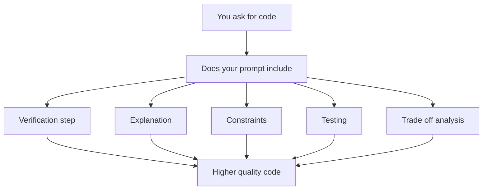
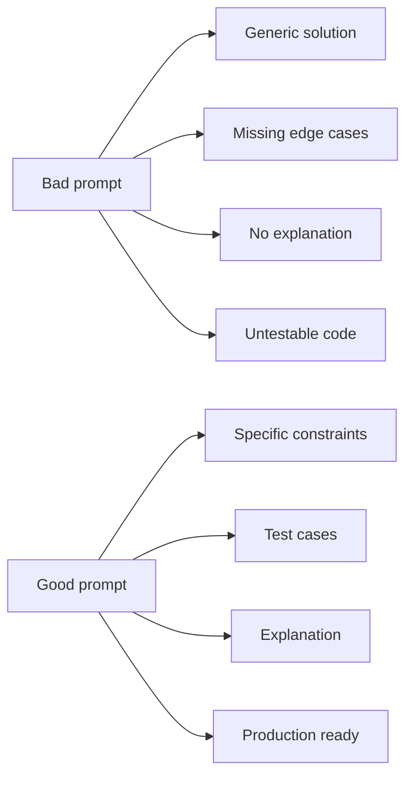
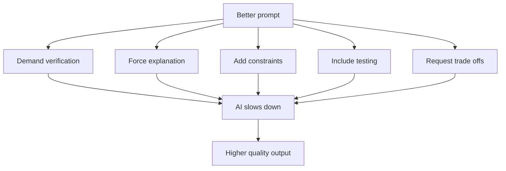

# AI-Assisted Coding: A Guide to Better Prompts

**For Development Teams Using AI to Generate and Review Code**

## Table of Contents

1. [The Core Problem](#the-core-problem)  
2. [The Prompt Strategy Framework](#the-prompt-strategy-framework)  
3. [10 Practical Prompting Patterns](#10-practical-prompting-patterns)  
4. [Examples by Language](#examples-by-language)  
5. [Common Mistakes to Avoid](#common-mistakes-to-avoid)  
6. [Checklist for Code Reviews](#checklist-for-code-reviews)  

---

## The Core Problem

### Why AI-Generated Code Is Not Automatically Good

```
Generated code does not self check → Syntax compiles → Logic errors hide
```

AI can produce code that:

- Compiles successfully but has subtle bugs  
- Works for happy paths but fails on edge cases  
- Lacks error handling or security considerations  
- Is inefficient or hard to maintain  
- Misses your team’s coding standards  

**The fix:** Better prompts demand verification, explanation, and critical thinking.

---

## The Prompt Strategy Framework



---

## 10 Practical Prompting Patterns

### 1. Ask for Verification as a Separate Step

**Weak**

```text
Write a function to sort this array in Python.
```

**Better**

```text
Write a Python function to sort an array.
Before giving me the final code, review it for:
1. Edge cases
2. Performance issues
3. Common bugs

Then explain what you checked.
```

**Why it works:** Forces a second pass. AI validates instead of only generating.

---

### 2. Specify Requirements Upfront

**Weak**

```text
How do I connect to a database?
```

**Better**

```text
Write Node.js code to connect to a PostgreSQL database with:
- Proper error handling
- Connection pooling
- Security best practices

Explain your security choices.
```

**Why it works:** Specificity prevents vague or unsafe solutions.

---

### 3. Request Explanation of Logic

```text
Fix this broken code. Then explain:
1. What the bug was
2. Why it happened
3. How your fix solves it
4. Remaining edge cases
5. How you would test it
```

**Why it works:** If it cannot explain it, the logic is likely weak.

---

### 4. Ask for Multiple Approaches With Trade offs

```text
Show 2 to 3 optimization approaches.
For each, explain:
- Time and space complexity
- Readability
- Memory usage
- When to use it

Recommend the best option for production.
```

---

### 5. Request Test Scenarios

```text
Write an email validation function.
Include test cases for:
- Valid formats
- Invalid formats
- Edge cases

Explain why each test matters.
```

---

### 6. Ask for Common Pitfalls

```text
Write JSON parsing code for production.
Afterward list:
- Common mistakes
- How your approach avoids them
- Additional robustness improvements
```

---

### 7. Specify Context and Constraints

```text
I am building a React app that fetches data on mount.
Include:
- Loading states
- Error handling
- Cleanup
- Request cancellation

Explain why each is needed.
```

---

### 8. Request a Code Review Mindset

```text
Write authentication middleware.
Then review it as a security focused reviewer.
Identify risks and improvements.
```

---

### 9. Ask for Before and After Comparison

```text
Refactor this code.
Show:
- Original
- Refactored
- Explanation of each change
```

---

### 10. Request Documentation Standards

```text
Write a utility function with:
- Docstrings
- Clear variable names
- Comments for non obvious logic
- Example usage

Would a junior developer understand this?
```

---

## Examples by Language

### JavaScript Node.js: API Rate Limiter

```text
Write a Node.js middleware that:
- Allows 100 requests per minute per IP
- Uses in memory storage
- Returns HTTP 429 when exceeded

Verify concurrency handling, proxy behavior, and testing strategy.
```

---

### Python: Database Query Optimization

```text
Write a SQLAlchemy query that:
- Avoids N plus one queries
- Handles millions of rows
- Returns comment counts

Explain indexing and monitoring choices.
```

---

### TypeScript: Type Safe API Client

```text
Write a TypeScript API client with:
- Typed requests and responses
- Retry on server errors
- Timeouts
- Custom error types

Explain how it handles API changes.
```

---

## Common Mistakes to Avoid



### Mistakes Table

| Mistake                   | Impact                   | Fix                             |
| ------------------------- | ------------------------ | ------------------------------- |
| Too vague                 | Generic code             | Add constraints                 |
| No security requirements  | Vulnerable code          | Explicitly ask about security   |
| No error handling mention | Crashes in production    | Request error scenarios         |
| No testing request        | Untested code            | Ask for test cases upfront      |
| No explanation required   | You do not understand it | Always ask why                  |
| One solution only         | You miss alternatives    | Ask for 2 to 3 approaches       |
| No performance criteria   | Slow code slips through  | Specify complexity requirements |

---

## Checklist for Code Reviews

Use this when reviewing AI-generated code.

### Before Accepting Any AI Code

- [ ] Does it compile or run  
- [ ] Can you explain it  
- [ ] Edge cases tested  
- [ ] Error handling present  
- [ ] Security reviewed  
- [ ] Performance acceptable  
- [ ] Style consistent  
- [ ] Well documented  
- [ ] Tests included  
- [ ] Dependencies justified  

### Questions to Ask the AI

1. Why this approach  
2. What are the failure modes  
3. What would you change for production  
4. How would you test this  
5. What is the time complexity  

---

## The Pattern That Works Across All Domains



### The Core Formula

```
Good code = Verification + Explanation + Constraints + Testing + Trade off analysis
```

---

## Quick Reference: Prompt Template

```text
I need code that does a specific task.

Context:
- Environment
- Constraints
- Edge cases

Before submitting:
1. Verify correctness
2. Explain trade offs
3. Identify risks
4. Provide test cases

Compare multiple approaches if applicable.
```

---

## Team Best Practices

### When Using AI for Code Generation

1. Never copy paste without review  
2. Request verification explicitly  
3. Document the reasoning  
4. Include test cases upfront  
5. Specify security from the start  
6. Ask for production concerns  
7. Review for your standards  

### Code Review Template for AI-Generated Code

```text
Reviewed for logic correctness
Tested edge cases manually
Security concerns addressed
Complexity acceptable for our scale
Matches team conventions
Error handling complete
Well documented
Performance acceptable
Approved by reviewer
```

---

## Key Takeaway

**AI-generated code is as good as your prompt.**

Better prompts produce code that is verified, explained, constrained, tested, and well-reasoned.  
Weak prompts produce code that compiles but fails in production.

---

**Last Updated:** February 2026  
**For:** Development Teams  
**Related:** Code Review Standards, Security Guidelines, Testing Requirements
