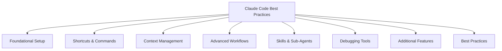

# **Claude Code Best Practices & Tips for 2026**

## **Overview**

Claude Code is an agentic coding assistant that can read your codebase, run commands and autonomously make changes based on your instructions. Getting the most value out of it depends on how you set up your environment, manage context and use its tools and workflows. This document summarizes the top practices and shortcuts drawn from recent guides and official documentation to help you work smarter and faster.

## **Foundational Setup**

- **Run in project root:** Always start Claude Code from the root of your project so it has access to your full codebase .
- **Initialize a** **claw.md** **file:** Use the /init command to generate claw.md, which should describe coding standards, architecture and validation flows . Refining this file over time ensures Claude receives clear guidance .
- **Define rules and architecture:** Document any special protocols, dependencies or validation steps so Claude can follow project‑specific conventions .

## **Workflow Shortcuts & Commands**

- **Switch modes:** Use **Shift + Tab** to toggle between Plan Mode and Edit Mode for planning before execution .
- **Interrupt and rewind:** Press **Esc** to stop a process; double‑tap **Esc** to rewind to previous checkpoints .
- **Reset context:** /clear resets the session, while /compact condenses long transcripts to free context .
- **Inspect and resume:** /context displays the current context; /resume restores a session after interruption .
- **Track context:** Monitor context window usage and clear it often .

## **Context Management Strategies**

- **Start fresh:** Begin each session with a clean, concise context to avoid clutter .
- **Validate frequently:** Create validation loops to check outputs and improve reliability .
- **Save and load context:** Persist contexts to disk when switching projects or before clearing to maintain continuity .
- **Clear and compact proactively:** Use /clear between unrelated tasks and instruct Claude how to compact context in claw.md .

## **Advanced Workflows**

- **Plan Mode:** Separate exploration and planning from implementation by running tasks in Plan Mode before coding.
- **Parallel development:** Run multiple Claude sessions or Git Worktrees to work on several branches or features at once .
- **Reusable skills:** Create composable “skills” (scripted workflows) and combine them with commands; use Model Context Protocols (MCPs) to manage token budgets .
- **Sub‑agents:** Delegate independent tasks to sub‑agents to research or verify code in a separate context, but avoid tasks that need shared context  .

## **Debugging & Validation Tools**

- **Automated debugging:** Use tools like Puppeteer or the /chrome command to run tests and validate UI changes .
- **Hooks and linters:** Set up pre‑ and post‑execution hooks for tasks such as linting, formatting or running tests .
- **Verification criteria:** Provide tests, expected outputs or screenshots so Claude can verify its work automatically .

## **Additional Features**

- **Notifications:** Enable notifications to stay informed about task completion or summary results .
- **Plugins:** Explore community plugins to extend Claude’s capabilities for specialized tasks .
- **Version control integration:** Use Git to maintain history and restore context via branches or worktrees .

## **Best Practices for Optimal Results**

- **Keep** **claw.md** **current:** Update it as the project evolves to ensure Claude follows the latest standards .
- **Use Git as a safety net:** Leverage branches and worktrees for context restoration and collaboration .
- **Focus on context engineering:** Structure prompts and context carefully—provide relevant code files, remove irrelevant chat, and prune conversation history .
- **Leverage checkpoints:** Double‑tap **Esc** or run /rewind to restore to earlier checkpoints when you need to undo changes .
- **Scale horizontally:** Run multiple sessions to separate writing, reviewing and testing; use headless mode (claude -p) for CI integration and scripted tasks .

## **Key Takeaways**

Mastering Claude Code involves establishing a strong foundation with a well‑defined claw.md, using keyboard shortcuts and commands to manage context effectively, and adopting advanced workflows like Plan Mode, parallel sessions and sub‑agents. By keeping context clean, validating outputs and continuously refining your environment, you can maximize productivity and ensure Claude produces reliable, high‑quality code